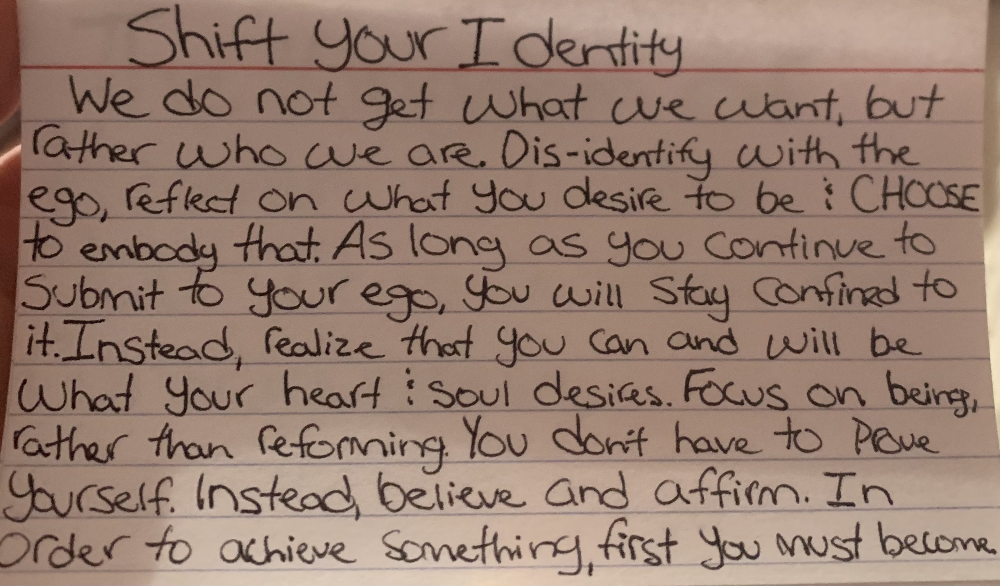

# Daily Wisdom With Everett

***

## An ALTER EGO Could Change Your Life



## Power of Positive Thinking


***

### Power of Positive Thinking - Quotes

**"There Is A Tendency In Human Nature To Become Precisely Like That Which You Habitually Imagine Yourself To Be"**

### You Are What You Think About

**"Always Ask If Your Thoughts Deserve The Time, Attention, And Focus They Are**\
**Receiving.''**

***

#### Notes


```
I find the best way to remove problems that seem to overbear you, is to love them. Every single one, and to visualize this problem, and to think of how these issues you deal with have the potential to better your life, in any way, shape, or form. No matter how stressful, how tedious, or painful these problems are, once you remove the negative feelings attached to them, they become opportunities rather than problems.
```


***

## Newtons Law For Reality Creation


***

**Realize**:

* Most People Try To Change Their Reality
*   Focus = Energies

    Resistance <----> Desire
* When You Focus On Unwanted, You Give It Power And It Grows

**Solution**:

* Complete Acceptance of Your Current Reality
* Pure Focus on Your Desired Reality

**Stop Giving Focus To The Unwanted. Accept What Is And Shift To Desired.**

***

### Notes


```
The key to growth is understanding that without changing the underlying structure, (yourself) nothing will change. It will be a long and usually fruitless battle with yourself to change your habits, actions and patterns when you identify with them. Instead, start and end your day identifying who you wish to be, how you wish to think, how you wish to feel, and what not. Next, stop giving power to what bothers you. Your power = your awareness. The more you react and focus your awareness on the negative, the more it plays a part in your life. If you can be indifferent, or better yet love it, it will remove itself from your life. 
```


***

## Shift Your Identity



***

* We Do Not Get What We Want, But Rather Who We Are.
* Dis-identify With The Ego, Reflect On What You Desire To Be And **CHOOSE** To Embody That.
* As Long As You Continue To Submit To Your Ego, You Will Stay Confined To It. Instead, Realize That You Can And Will Be What Your Heart And Soul Desires.
* Focus On Being, Rather Than Reforming.
* You **Don’t** Have To Prove Yourself. Instead, Believe And Affirm.
* In Order To Achieve Something, First You Must Become.

***

### Notes


```
We are all playing as characters, and we have the choice consciously too choose what that character is. Take some time too think about who you want too be and write it down. Then, embody that person as if you already are that person. How would this version of me think? How would this version of me respond to this situation? Dont focus on reforming because you are creating more problems than needed. Finally, feel it to be true, for feelings are the way you respond to your subconscious, and your subconscious is what makes this a reality.
```


***

## The Magician's Way


**"When You Go For Things In Life, Nothing Will Change Until The Underrying Structure**\
**Changes"**

***

## The Mirror Principle


***

* The Idea That Your Outer World Is Merely A Reflection Of Your Inner World.
* Most People Try To Manipulate The Reflection. Instead, Influence The Reflection Indirectly By Changing The Image You Present.

***

### LAW ONE

* The Mirror Reflects Relationship To Self And World.
  * If You Believe You're Not Good Enough, The Mirror Will Reflect This.
* The Mirror Will Always Confirm What You Believe To Be True About Your Identity And Paradigms.

#### Interrupt The Pattern

**Form Your Identity and Paradigms**

* Write Your Self-Views
* Write Your Paradigms

**Believe These To Be True!**

***

### LAW TWO

**The Reflection Is Formed With Delay**

* Stay with your assumption long enough to manifest.

***

### LAW THREE

**The Mirror Of Reality Does Not Reflect The Nature Of Your Thoughts, But The Pure Content Of It.**

* I.E. "'I Hate My Job" Will Result In More Things To Piss You Off In Your Job
* Glass Half Full

***

#### Notes


```
This right here is how you apply what I wrote above. Instead of continuing too give in too old beliefs and ideas about life that bring you down, you use this to form your thoughts and beliefs that help you. For example, if you have the firm belief that something always stressed you out, change your thought too, “this is easy and I handle it with zero problems”. You have to feel it to be true however, and the greatest way is to catch yourself in a old belief and thought, step back and change that thought and feeling.
```


***

## The Power of Your Subconcious

[The Power of Your Subconcious](https://www.youtube.com/watch?v=fk2neb420R0\&t=4s\&pp=2AEEkAIB)

***

## You Are What You Think About


<figure><figcaption></figcaption></figure>

## Eliminate Procrastination

***

Procrastination Stems From Not Having A Good Enough Reason / Motive To Act.

**Keys:**

1. Find Your Core Drives That Push You To\
   Act.

* Understand: As Humans We Want To Move Away From Pain And Towards Pleasure
* What Causes You Pain That Makes: You Move Away?
* A What Gives You Fulfillment That Males You Move Towards?
* What Is Your Core Drive It?
* Turn Your Stress, Doubt, Fears, Worry To Fuel Your\
  Good, Stress > Distress

2. If You Don't Do What You Need To Do, What Are You Sacrificing?
   * If You Perform This Action, What Are You Gaining?

> If You Dont Sacrifice For Your Dreams, Your Dreams Become The Sacrifice.

3. Gain Clarity On What You Want, Why You Want, And Who You Are Being To Achieve This.
   * Self Imposed Deadlines

***


```
The greatest way to remove procrastination from your life is to envision and truly live in your desired reality, where you enjoy and have so much fun in this world that you make it come alive in your world. 

```

